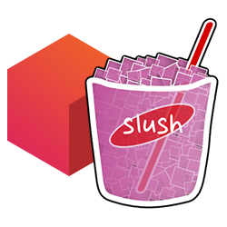

[](https://www.npmjs.com/package/slush-stackdot) [](https://www.npmjs.com/package/slush-stackdot) [](https://www.npmjs.com/package/slush-stackdot) 

[](https://drone.stackdot.com/stackdot/slush-stackdot) [](https://david-dm.org/stackdot/slush-stackdot)

<p align="center"></p>

Stackdot Slush Generator
===

Slush generator for:
- New UI Projects
- UI Modules
- New API Projects


Getting Started:
---

First you need to install the slush generator.

Requirements:
- Slush installed globally `npm install slush -g`

Then to install the generator:

```bash
npm install slush-stackdot -g
```


To create a new UI project:
---

Run the following from the root directory of your new project:

```bash
slush stackdot
```
Is the short have for:
```bash
slush stackdot:ui
```

Create a UI module:
---

Be in the directory of the new module. For instance if your new module name is going to be "header", you should run the following command from `app/modules/header`. Slush will populate this directory with the new module contents.

```bash
slush stackdot:module
```

Create a new API project
---

When creating a new API project you will have the option to include database(s)
- MongoDB
- LevelDB
- MySQL

Run the following from the root directory of your new project:

```bash
slush stackdot:api
```


License
----

[MIT License](http://en.wikipedia.org/wiki/MIT_License)